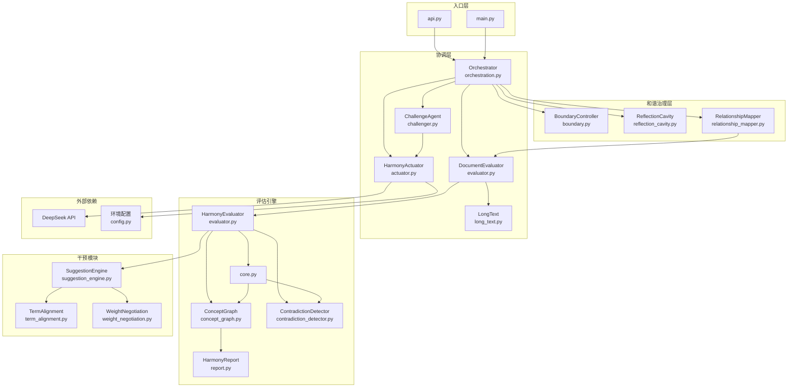
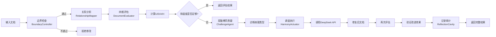

# ThinkCheck Agent - 项目结构文档

## 📋 项目概述

**项目名称**: ThinkCheck Agent v6  
**项目描述**: 基于晶脉哲学与谐振理论的文档和谐度评估与调谐服务，提供四维评估（U/D/A/H）和自动调谐能力。  
**版本**: v6.0.0  

---

## 📁 目录结构

```
thinkcheck-agent-v6/
├── api.py                    # REST API 服务入口
├── main.py                   # 命令行入口
├── config.py                 # 配置管理模块
├── requirements.txt          # 项目依赖
├── .env.example              # 环境变量示例
├── config.example.yaml       # 配置文件示例
├── README.md                 # 项目说明
├── LICENSE                   # 许可证
├── demo.txt                  # 演示文本
├── complex_case.txt          # 复杂案例文本
├── low_harmony_case.txt      # 低和谐度案例
├── report.json               # 报告输出示例
├── force_report.json         # 强制演示报告
├── VERIFICATION_REPORT.md    # 验证报告
├── UPGRADE_VERIFICATION_REPORT.md  # 升级验证报告
├── run_demo.py               # 演示脚本
├── run_demo_cases.py         # 演示案例测试
├── force_demo.py             # 强制API调用演示
├── evaluate_business_text.py # 商业文本评估
├── real_functionality_test.py # 真实功能测试
├── run_all_test_cases.py     # 运行所有测试案例
├── test_upgrade.py           # 升级测试
├── test_upgrade_simple.py    # 简单升级测试
├── verify_upgrade.py         # 升级验证
├── examples/
│   └── real_world_example.py # 真实世界示例
├── tests/
│   ├── __init__.py
│   └── test_harmony_metrics.py # 和谐度指标测试
├── ochr/                     # 和谐治理模块
│   ├── __init__.py
│   ├── boundary.py           # 边界控制器
│   ├── reflection_cavity.py  # 反思腔（审计记录）
│   └── relationship_mapper.py # 关系映射器
├── thinkcheck_agent/         # 核心Agent模块
│   ├── __init__.py
│   ├── core/
│   │   ├── __init__.py
│   │   ├── orchestration.py  # 协调器
│   │   ├── evaluator.py      # 文档评估器
│   │   ├── actuator.py       # 调谐执行器
│   │   ├── challenger.py     # 双脑博弈质疑器
│   │   └── long_text.py      # 长文本处理
│   ├── tools/
│   │   ├── __init__.py
│   │   └── file_handler.py   # 文件处理工具
│   ├── workflows/
│   │   ├── __init__.py
│   │   └── legal_doc_review.py # 法律文档审阅工作流
│   └── examples/
│       └── __init__.py
├── thinkcheck_harmony/       # 和谐度SDK（简化版）
│   ├── __init__.py
│   └── utils.py              # 工具函数
├── thinkcheck-harmony/       # ThinkCheck Harmony SDK（完整包）
│   ├── README.md
│   ├── LICENSE
│   ├── pyproject.toml
│   ├── setup.py
│   ├── requirements.txt
│   ├── build_package.py
│   ├── build_simple.py
│   ├── quick_build.py
│   ├── demo_output.txt
│   ├── docs/
│   │   └── contradiction_harvester.md
│   ├── examples/
│   │   ├── basic_evaluation.py
│   │   └── intervention_demo.py
│   ├── tests/
│   │   ├── __init__.py
│   │   ├── test_core.py
│   │   ├── test_evaluator.py
│   │   └── test_harvesters.py
│   └── thinkcheck_harmony/
│       ├── __init__.py
│       ├── core.py           # 核心计算引擎
│       ├── evaluator.py      # 评估器
│       ├── contradiction_detector.py # 矛盾检测器
│       ├── concept_graph.py  # 概念图谱
│       ├── config.py         # 配置
│       ├── report.py         # 报告数据结构
│       ├── intervention/
│       │   ├── __init__.py
│       │   ├── base.py       # 抽象基类
│       │   ├── suggestion_engine.py # 建议引擎
│       │   ├── term_alignment.py    # 术语对齐
│       │   └── weight_negotiation.py # 权重协商
│       ├── presets/
│       │   ├── __init__.py
│       │   ├── general.py    # 通用预设
│       │   ├── legal.py      # 法律领域预设
│       │   └── medical.py    # 医疗领域预设
│       └── utils/
│           ├── __init__.py
│           ├── embedding.py  # 嵌入工具
│           └── text_processing.py # 文本处理
└── thinkcheck_product/       # ThinkCheck 产品版
    ├── README.md
    ├── LICENSE
    ├── CONTRIBUTING.md
    ├── pyproject.toml
    ├── setup.py
    ├── release.py
    ├── examples/
    │   ├── basic_usage.py
    │   └── improved_example.py
    ├── tests/
    │   ├── __init__.py
    │   ├── test_core.py
    │   └── test_decorator.py
    └── thinkcheck/
        ├── __init__.py
        ├── core.py           # 核心监控器
        ├── decorator.py      # 装饰器
        └── improved.py       # 改进版本
```

---

## 🧩 核心功能模块

### 1. 入口层

| 文件 | 职责 | 类型 |
|------|------|------|
| `api.py` | REST API服务，提供评估和调谐端点 | 入口 |
| `main.py` | 命令行工具，支持文件批量处理 | 入口 |

### 2. 协调层（thinkcheck_agent/core/）

| 文件 | 职责 | 依赖 |
|------|------|------|
| `orchestration.py` | 协调器，管理评估-决策-执行-验证闭环 | evaluator, actuator, challenger, ochr |
| `evaluator.py` | 文档评估器，封装ThinkCheck Harmony SDK | thinkcheck_harmony, long_text |
| `actuator.py` | 调谐执行器，调用DeepSeek API进行文档修复 | config |
| `challenger.py` | 双脑博弈质疑器，对评估结果进行反思性挑战 | actuator |
| `long_text.py` | 长文本处理模块，提供分块和跨块矛盾检测 | numpy |

### 3. 和谐治理层（ochr/）

| 文件 | 职责 | 依赖 |
|------|------|------|
| `boundary.py` | 边界控制器，检查文档是否包含禁止修改的内容 | re |
| `reflection_cavity.py` | 反思腔，审计和记录文档处理过程 | json |
| `relationship_mapper.py` | 关系映射器，分析文档各部分之间的依赖关系 | networkx |

### 4. 评估引擎（thinkcheck-harmony/thinkcheck_harmony/）

| 文件 | 职责 | 依赖 |
|------|------|------|
| `core.py` | 核心计算引擎，实现H=λU·U+λD·D-λA·A公式 | concept_graph, contradiction_detector |
| `evaluator.py` | 评估器，集成概念图谱和矛盾检测 | core, concept_graph, contradiction_detector |
| `concept_graph.py` | 概念图谱，计算术语一致性和漂移检测 | numpy, sklearn |
| `contradiction_detector.py` | 矛盾检测器，检测对抗性指标A | text_processing |
| `report.py` | 报告数据结构，包含三重嵌套拓扑 | dataclasses |
| `config.py` | 全局配置与默认权重 | - |

### 5. 干预模块（thinkcheck-harmony/thinkcheck_harmony/intervention/）

| 文件 | 职责 |
|------|------|
| `base.py` | 矛盾捕获器抽象基类 |
| `suggestion_engine.py` | 建议引擎，生成调谐建议 |
| `term_alignment.py` | 术语对齐捕获器 |
| `weight_negotiation.py` | 权重协商捕获器 |

### 6. 工具层

| 文件 | 职责 |
|------|------|
| `thinkcheck_agent/tools/file_handler.py` | 文件读写、编码检测 |
| `thinkcheck_agent/workflows/legal_doc_review.py` | 法律文档审阅工作流 |
| `thinkcheck_harmony/utils.py` | 文本处理、关键词提取等辅助函数 |

### 7. ThinkCheck Product（thinkcheck_product/）

| 文件 | 职责 |
|------|------|
| `core.py` | 和谐度监控器，实时监控LLM推理质量 |
| `decorator.py` | `@thinkcheck`装饰器，自动监控函数调用 |
| `improved.py` | 改进版本，支持多语言和智能回溯 |

---

## 🔗 依赖关系图

### 架构层次图



### 核心数据流



---

## 📡 API端点列表

| 端点 | 方法 | 描述 | 参数 |
|------|------|------|------|
| `/` | GET | 根端点，返回服务信息 | - |
| `/health` | GET | 健康检查 | - |
| `/evaluate` | POST | 评估文档和谐度 | `document`, `workflow_type`, `auto_fix` |
| `/harmonize` | POST | 和谐化文档（评估+修复+验证） | `document`, `workflow_type`, `auto_fix` |
| `/session/summary` | GET | 获取会话摘要 | - |

### 请求/响应模型

**DocumentInput**:
```json
{
    "document": "待处理的文档内容",
    "workflow_type": "legal_review",
    "auto_fix": true
}
```

**HarmonizeResponse**:
```json
{
    "request_id": "xxx",
    "status": "success",
    "initial_scores": {"U": 0.5, "D": 0.6, "A": 0.3, "H": 0.4},
    "final_scores": {"U": 0.7, "D": 0.7, "A": 0.2, "H": 0.6},
    "improvement": 0.2,
    "fixed_document": "修复后的文档",
    "fix_strategy": "优化策略",
    "suggestions": [],
    "warnings": [],
    "ochr_info": {}
}
```

---

## 🚀 使用方法

### 1. 环境配置

```bash
# 复制环境变量示例
cp .env.example .env

# 编辑 .env 文件，添加 DeepSeek API Key
# DEEPSEEK_API_KEY=your_api_key_here
```

### 2. 安装依赖

```bash
pip install -r requirements.txt
```

### 3. 启动API服务

```bash
python api.py
```

### 4. 命令行使用

```bash
# 处理单个文件
python main.py --file document.txt

# 批量处理目录
python main.py --dir ./documents --pattern "*.md"

# 只评估不修复
python main.py --file document.txt --no-fix

# 简单模式（禁用OCHR）
python main.py --file document.txt --mode simple
```

### 5. API调用示例

```bash
curl -X POST http://localhost:8000/evaluate \
  -H "Content-Type: application/json" \
  -d '{"document": "功能强大，但完全没用。"}'
```

---

## 📊 四维评估指标

| 指标 | 符号 | 含义 | 计算方式 | 权重 |
|------|------|------|----------|------|
| 统一性 | U | 术语一致性，概念在文档中使用的一致性程度 | 概念图谱平均一致性 | 0.4 |
| 发展性 | D | 论证发展性，概念在文档中出现位置的分布 | 位置标准差 | 0.4 |
| 对抗性 | A | 矛盾对抗性，转折连词和矛盾规则匹配 | 标记密度+规则匹配 | 0.2 |
| 和谐度 | H | 综合和谐度，反映文档整体质量 | H = λU·U + λD·D - λA·A | - |

### 病理判定规则

| 和谐度范围 | 病理类型 | 说明 |
|-----------|----------|------|
| H ≥ 0.9 | 谐振态 | 文档质量优秀，无需调谐 |
| H ≥ 0.6 | 谐振态 | 文档质量良好 |
| H ≥ 0.4 且 A < 0.2 | 度假合格 | 合格但缺乏深度 |
| U < 0.3, A > 0.7, H < 0 | 逻辑自杀 | 严重逻辑矛盾 |
| D < 0.2, A < 0.3, H < 0.4 | 逻辑空洞 | 缺乏论证发展 |
| 其他 | 需调谐 | 需要优化改进 |

---

## 🗑️ 冗余文件识别与处理建议

### 临时/输出文件

| 文件 | 类型 | 建议 |
|------|------|------|
| `report.json` | 演示输出 | 删除，运行demo会自动生成 |
| `force_report.json` | 演示输出 | 删除，运行force_demo会自动生成 |
| `demo_output.txt` | 演示输出 | 删除 |
| `output_fixed.txt` | 示例输出 | 删除 |

### 测试文件

| 文件 | 类型 | 建议 |
|------|------|------|
| `run_all_test_cases.py` | 测试脚本 | 保留，用于回归测试 |
| `real_functionality_test.py` | 测试脚本 | 保留，用于功能验证 |
| `test_upgrade.py` | 升级测试 | 删除，升级完成后不再需要 |
| `test_upgrade_simple.py` | 升级测试 | 删除 |
| `verify_upgrade.py` | 升级验证 | 删除 |
| `tests/` | 测试目录 | 保留 |

### 重复功能文件

| 文件 | 重复来源 | 建议 |
|------|----------|------|
| `thinkcheck_harmony/` | 简化版SDK | 删除，使用 `thinkcheck-harmony/` 完整版 |
| `thinkcheck-harmony/` | 完整SDK包 | 保留，核心评估引擎 |
| `thinkcheck_product/` | 产品版监控器 | 保留，独立功能模块 |

### 旧版本文件

| 文件 | 说明 | 建议 |
|------|------|------|
| `thinkcheck_product/thinkcheck/improved.py` | 改进版本 | 保留，提供更好的功能 |
| `VERIFICATION_REPORT.md` | 验证报告 | 删除，历史文件 |
| `UPGRADE_VERIFICATION_REPORT.md` | 升级报告 | 删除，历史文件 |

---

## 📈 项目统计报告

### 基础统计

| 指标 | 数值 |
|------|------|
| 总文件数（不含.venv） | ~60个Python文件 |
| 代码总行数（估算） | ~3000行 |
| 核心功能模块 | 6个 |
| 子项目 | 3个（thinkcheck_agent, thinkcheck-harmony, thinkcheck_product） |

### 主要依赖库

| 库 | 版本 | 用途 |
|----|------|------|
| `fastapi` | >=0.100.0 | API框架 |
| `uvicorn` | >=0.20.0 | ASGI服务器 |
| `openai` | >=1.0.0 | DeepSeek API调用 |
| `pydantic` | >=2.0.0 | 数据验证 |
| `pydantic-settings` | >=2.0.0 | 配置管理 |
| `loguru` | >=0.7.0 | 日志记录 |
| `numpy` | >=1.20.0 | 数值计算 |
| `networkx` | >=3.0 | 图分析 |
| `pyyaml` | >=6.0 | YAML配置 |
| `aiofiles` | >=23.0.0 | 异步文件操作 |
| `python-dotenv` | >=1.0.0 | 环境变量 |
| `pytest` | >=7.0.0 | 测试框架 |

### 推荐入口文件

| 场景 | 推荐入口 |
|------|----------|
| API服务 | `api.py` |
| 命令行工具 | `main.py` |
| 演示测试 | `run_demo.py` |
| 功能验证 | `real_functionality_test.py` |
| 快速示例 | `examples/real_world_example.py` |

---

## 🎯 核心设计理念

1. **谐振理论**: H = λU·U + λD·D - λA·A，平衡统一性、发展性和对抗性
2. **双脑博弈**: ChallengeAgent对评估结果进行反思性挑战，实现"反对齐"
3. **OCHR架构**: 边界控制(Boundary)、关系映射(Relationship)、反思腔(Cavity)
4. **三重嵌套拓扑**: Micro(术语级) → Meso(句子级) → Macro(文档级)
5. **可协商原则**: 权重λU/λD/λA可根据领域需求动态调整

---

## ⚠️ 注意事项

1. **DeepSeek API Key**: 运行调谐功能需要配置有效的DeepSeek API Key
2. **语义模型**: 长文本处理需要下载SentenceTransformer模型（首次运行自动下载）
3. **OCHR模式**: `--mode simple` 禁用OCHR组件，适合快速评估
4. **阈值配置**: 默认和谐度阈值0.7，对抗性阈值0.3，可通过配置文件调整